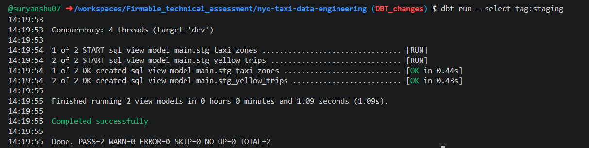
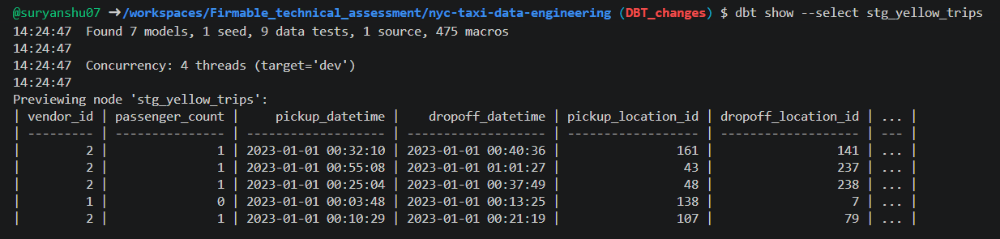
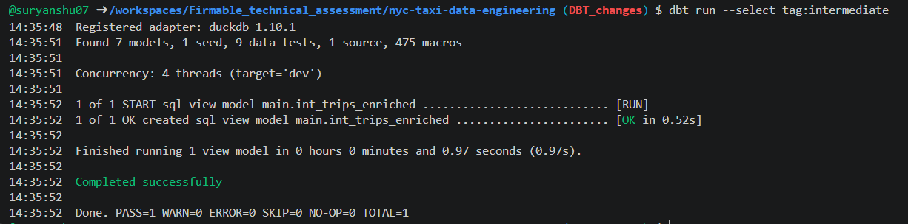
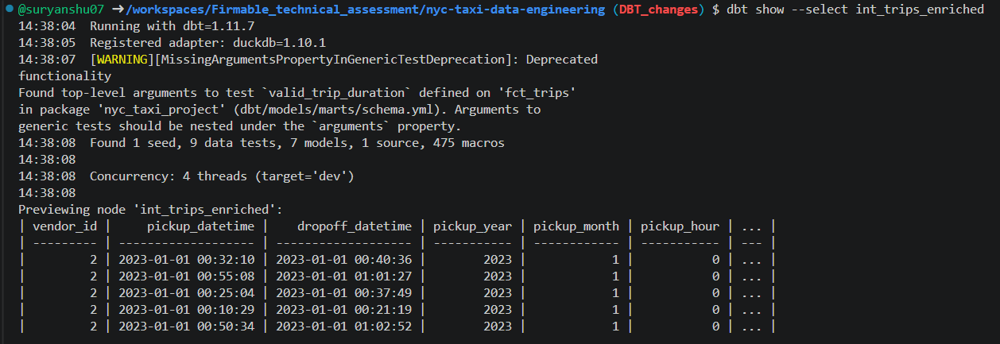
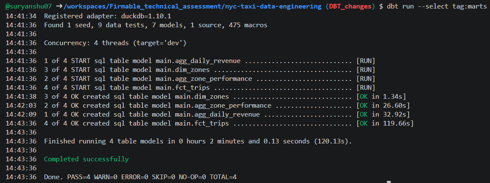
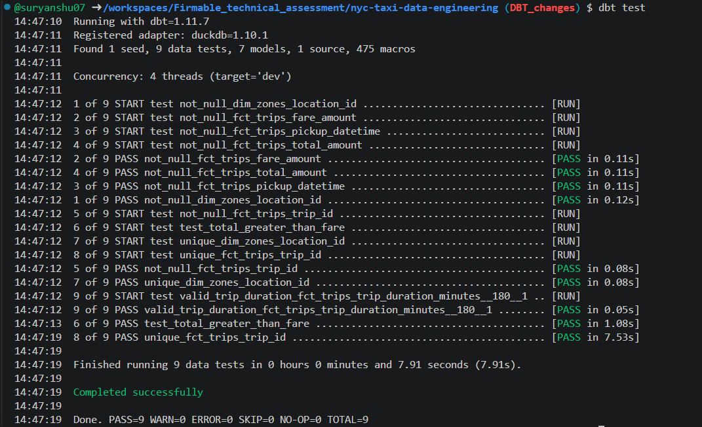

# Firmable_technical_assessment
This repo contains the solution of the complete technical round of Firmable.
📘 Staging Layer Documentation (models/staging/)
🎯 Objective

The staging layer standardizes raw NYC Taxi data into a clean, consistent format that downstream models can reliably consume.

*Successful execution of staging models using dbt*

*Sneak peak of the data*

It acts as a thin transformation layer that:

Renames columns to a consistent naming convention
Casts data types appropriately
Adds basic derived fields
Avoids heavy business logic (kept for later layers)
📂 Models Overview
1. stg_yellow_trips.sql
📌 Purpose

Transforms raw trip data from the source (yellow_tripdata) into a structured, analytics-ready format.

🔧 Transformations Applied
✅ Column Standardization
Converted all column names to snake_case
Example:
VendorID → vendor_id
tpep_pickup_datetime → pickup_datetime
✅ Data Type Casting
Ensures consistency across downstream layers
Column	Type
pickup_datetime	TIMESTAMP
dropoff_datetime	TIMESTAMP
passenger_count	DOUBLE
trip_distance	DOUBLE
fare_amount	DOUBLE
tip_amount	DOUBLE
total_amount	DOUBLE
✅ Derived Columns
Trip Duration (minutes)
DATEDIFF('minute', pickup_datetime, dropoff_datetime)

👉 Enables:

Filtering unrealistic trips later
Time-based analytics
✅ Time Dimensions

Extracted for downstream aggregations:

pickup_year
pickup_month
pickup_hour
📥 Source
FROM {{ source('nyc_taxi', 'yellow_tripdata') }}

👉 Defined in sources.yml with freshness checks

⚙️ Materialization
materialized = 'view'

Why view?

Lightweight transformation
Avoids duplicating large raw dataset (~38M rows)
Always reflects latest source data
2. stg_taxi_zones.sql
📌 Purpose

Standardizes taxi zone lookup data for use in joins.

🔧 Transformations Applied
Renamed columns:
LocationID → location_id
Borough, Zone, service_zone kept consistent
📥 Source
FROM {{ ref('taxi_zone_lookup') }}

👉 Loaded via dbt seed

⚙️ Materialization
materialized = 'view'

Why view?

Small dataset
No need to persist as table
Keeps pipeline simple
📄 sources.yml

Defines the raw data source:

sources:
  - name: nyc_taxi
    schema: main
    tables:
      - name: yellow_tripdata
        loaded_at_field: tpep_pickup_datetime
🔍 Freshness Check
freshness:
  warn_after: {count: 1, period: day}
  error_after: {count: 2, period: day}

👉 Ensures:

Data is recent
Alerts if pipeline runs on stale data

📘 Intermediate Layer Documentation (models/intermediate/)
🎯 Objective

*Successful execution of intermediate models using dbt*

*Sneak peak of the data at int*

The intermediate layer enriches and validates the staged data by:

Joining trips with zone metadata
Filtering out invalid or unrealistic records
Preparing a clean, business-ready dataset for downstream marts

This layer introduces core business logic while keeping transformations modular and reusable.

📂 Model Overview
int_trips_enriched.sql
📌 Purpose

This model:

Enriches trip data with pickup and dropoff zone details
Applies data quality filters
Produces a trusted dataset for analytics
🔗 Data Sources
FROM {{ ref('stg_yellow_trips') }} t
LEFT JOIN {{ ref('stg_taxi_zones') }} pz
    ON t.pickup_location_id = pz.location_id
LEFT JOIN {{ ref('stg_taxi_zones') }} dz
    ON t.dropoff_location_id = dz.location_id
🔧 Transformations Applied
✅ 1. Zone Enrichment

Adds human-readable location context:

Field	Description
pickup_borough	Borough of pickup
pickup_zone	Zone name
dropoff_borough	Borough of dropoff
dropoff_zone	Zone name

👉 This is critical for:

Business reporting
Zone-level analytics
Aggregations in marts
✅ 2. Data Quality Filtering

Invalid or unrealistic trips are removed:

trip_distance > 0
fare_amount > 0
passenger_count > 0
trip_duration_minutes BETWEEN 1 AND 180
🧠 Why these filters?
Condition	Reason
trip_distance > 0	Removes erroneous records
fare_amount > 0	Avoids free/invalid trips
passenger_count > 0	Ensures valid trips
Duration bounds	Removes outliers (data errors)
✅ 3. Column Propagation

Ensures important metrics are preserved:

fare_amount
tip_amount
total_amount
trip_duration_minutes

👉 Critical for downstream aggregations

⚙️ Materialization
materialized = 'view'
🧠 Why View?
Avoids duplicating large dataset
Keeps transformations lightweight
Allows fast iteration during development
🧠 Design Decisions
🔹 1. Separation of Concerns
Layer	Responsibility
Staging	Cleaning + formatting
Intermediate	Enrichment + filtering
Marts	Aggregation
🔹 2. Left Joins
LEFT JOIN stg_taxi_zones

👉 Ensures:

No data loss if zone mapping is missing
Preserves all valid trips
🔹 3. Filtering here (not staging)

👉 Keeps staging reusable
👉 Applies business rules only once

🔹 4. Reusable dataset

This model can power:

Fact tables
Exploratory queries
ML features

📘 Mart Layer Documentation (models/marts/)
🎯 Objective

*Successful execution of staging models using dbt*

*Sneak peak of the data*

The mart layer transforms enriched, validated data into business-ready datasets optimized for:

Reporting
Dashboarding
Analytical queries

It contains:

Fact tables (detailed events)
Dimension tables (descriptive attributes)
Aggregated tables (KPIs & metrics)
📂 Models Overview
fct_trips.sql
dim_zones.sql
agg_daily_revenue.sql
agg_zone_performance.sql
🧾 1. fct_trips.sql
📌 Purpose

Central fact table containing all valid taxi trips enriched with zone metadata.

📥 Source
FROM {{ ref('int_trips_enriched') }}
🔧 Transformations
Direct selection of cleaned + enriched data
No additional filtering (already handled upstream)
⚙️ Materialization
materialized = 'table'
🧠 Why Table?
Large dataset → avoid recomputation
Frequently queried
Acts as base for all aggregations
🚀 Outcome

Provides:

Granular trip-level data
Reliable source for all downstream analytics
🧾 2. dim_zones.sql
📌 Purpose

Dimension table containing taxi zone metadata.

📥 Source
FROM {{ ref('stg_taxi_zones') }}
🔧 Transformations
Deduplication (if needed)
Clean column naming
⚙️ Materialization
materialized = 'table'
🧠 Why Dimension Table?
Avoid repeated joins
Improves query readability
Enables star schema design
🧾 3. agg_daily_revenue.sql
📌 Purpose

Computes daily KPIs for business monitoring.

📥 Source
FROM {{ ref('fct_trips') }}
🔧 Metrics Computed
Metric	Description
total_trips	Total number of trips
total_fare	Sum of fare_amount
avg_fare	Average fare per trip
total_tips	Sum of tip_amount
tip_rate_percent	% of tips relative to total revenue
💡 Key Logic
CASE 
    WHEN SUM(total_amount) > 0 
    THEN (SUM(tip_amount) / SUM(total_amount)) * 100
    ELSE 0
END
⚙️ Materialization
materialized = 'table'
🧠 Why Important?
Tracks business performance daily
Useful for dashboards and trend analysis
🧾 4. agg_zone_performance.sql
📌 Purpose

Analyzes performance of pickup zones.

📥 Source
FROM {{ ref('fct_trips') }}
🔧 Metrics Computed
Metric	Description
total_trips	Trips per zone
avg_trip_distance	Avg distance
avg_fare	Avg fare
revenue_rank	Rank by revenue
high_volume_flag	Zones with >10,000 trips/month
🧠 Key Logic
✅ Revenue Ranking (Window Function)
RANK() OVER (
    PARTITION BY pickup_month
    ORDER BY SUM(total_amount) DESC
)
🎯 Why Monthly Ranking?
Accounts for seasonality
More meaningful than global ranking
Enables month-over-month comparison
✅ High Volume Flag
CASE 
    WHEN COUNT(*) > 10000 THEN 1
    ELSE 0
END
⚙️ Materialization
materialized = 'table'
🚀 Outcome

Provides:

Zone-level performance insights
Ranking for business prioritization
Identification of high-demand zones

📘 Data Quality & Testing Documentation (tests/ + schema.yml)
🎯 Objective

*Successful execution of all tests*

Ensure that all datasets produced in the pipeline are:

Accurate
Consistent
Reliable for downstream consumption

The project uses dbt tests to validate both:

Structural integrity (schema tests)
Business logic correctness (custom tests)
🧪 Types of Tests Implemented
✅ 1. Schema Tests (Built-in dbt)

Defined in schema.yml

🔹 Purpose

Validate basic data integrity:

No missing values
No duplicate keys
📌 Example
models:
  - name: dim_zones
    columns:
      - name: location_id
        tests:
          - not_null
          - unique
🧠 What this ensures
Every zone has a valid ID
No duplicate dimension entries
✅ 2. Custom Singular Test
📁 File:
tests/test_total_greater_than_fare.sql
🎯 Objective

Ensure:

Total amount ≥ Fare amount for every trip

💡 Why?
Total includes:
Fare
Tips
Taxes & surcharges

👉 So it should never be less than fare

🧾 Test Query
SELECT *
FROM {{ ref('fct_trips') }}
WHERE total_amount < fare_amount
🧠 Behavior
If query returns rows → ❌ FAIL
If empty → ✅ PASS
✅ 3. Custom Generic Test
📁 File:
tests/generic/test_trip_duration.sql
🎯 Objective

Ensure trip duration is within realistic bounds

🧾 Test Logic
SELECT *
FROM {{ model }}
WHERE trip_duration_minutes < {{ min_value }}
   OR trip_duration_minutes > {{ max_value }}
📌 Usage in schema.yml
models:
  - name: fct_trips
    columns:
      - name: trip_duration_minutes
        tests:
          - test_trip_duration:
              min_value: 1
              max_value: 180
🧠 Why this matters
Removes unrealistic trips
Prevents skewed analytics
Enforces business constraints

📘 SQL Analytics & Performance (queries/)
🎯 Objective

This section contains analytical SQL queries designed to extract business insights from the NYC Taxi dataset.

The queries are optimized for:

Large-scale datasets (~38M rows for 2023)
Snowflake execution (primary)
DuckDB compatibility (development)
📂 Queries Overview
queries/
├── q1_top_zones_by_revenue.sql
├── q2_hour_of_day_pattern.sql
└── q3_consecutive_gap_analysis.sql
🧾 Q1 — Top 10 Pickup Zones by Revenue (Monthly)
📌 Business Question

Which pickup zones generate the highest revenue each month?

🧠 Approach
Aggregate revenue at (month, pickup_zone) level
Use a window function (RANK) partitioned by month
Return Top 10 zones per month
🔑 Key Concepts
Window Functions (RANK() OVER)
Partitioning by time (monthly)
Pre-aggregation for performance
⚡ Performance Considerations
Early aggregation reduces data size before ranking
Filter on pickup_datetime enables partition pruning
Recommended clustering in Snowflake:
CLUSTER BY (DATE_TRUNC('month', pickup_datetime), pickup_zone)
📊 Output Preview
SELECT *
FROM q1_top_zones_by_revenue
LIMIT 10;

📸 (Add screenshot here)

💡 Insight Example
Identifies high-performing zones
Useful for demand planning and pricing strategies
🧾 Q2 — Hour-of-Day Demand Pattern
📌 Business Question

How does demand vary by hour of the day?

🧠 Approach
Extract hour from pickup_datetime
Compute:
Total trips
Average fare
Average tip percentage
Apply 3-hour rolling average on trip counts
🔑 Key Concepts
Time-based aggregation
Rolling window:
ROWS BETWEEN 2 PRECEDING AND CURRENT ROW
⚡ Performance Considerations
Aggregation before window function → reduces computation
Avoids scanning raw data multiple times
📊 Output Preview
SELECT *
FROM q2_hour_of_day_pattern
ORDER BY hour_of_day;

📸 (Add screenshot here)

💡 Insight Example
Peak hours (rush hours)
Low-demand periods
Pricing optimization opportunities
🧾 Q3 — Consecutive Trip Gap Analysis
📌 Business Question

Are there periods of low demand in specific zones?

🧠 Approach
Use LAG() to compare consecutive trips
Partition by:
pickup_zone
trip_date
Compute time gap between trips
Extract maximum gap per zone per day
🔑 Key Concepts
Window Functions (LAG)
Sequential event analysis
Time gap computation
⚡ Performance Considerations (Snowflake)
Cluster by (pickup_zone, trip_date)
Use date filters for partition pruning
Materialize intermediate dataset to reduce scan size
Leverage result caching for repeated queries